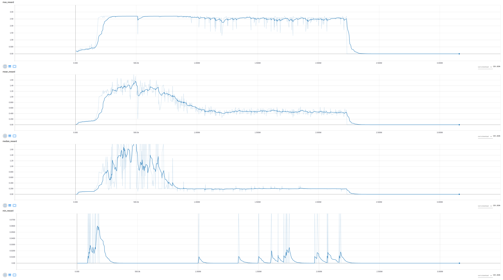

# Project 4: Collaboration and Competition

## Environment: Reacher
**[Copied from the Udacity Environment description:](https://classroom.udacity.com/nanodegrees/nd893/parts/ec710e48-f1c5-4f1c-82de-39955d168eaa/modules/89b85bd0-0add-4548-bce9-3747eb099e60/lessons/3cf5c0c4-e837-4fe6-8071-489dcdb3ab3e/concepts/da65c741-cdeb-4f34-bb56-d8977385596e)**

In this environment, two agents control rackets to bounce a ball over a net. If an agent hits the ball over the net, it receives a reward of +0.1. If an agent lets a ball hit the ground or hits the ball out of bounds, it receives a reward of -0.01. Thus, the goal of each agent is to keep the ball in play.

The observation space consists of 8 variables corresponding to the position and velocity of the ball and racket. Each agent receives its own, local observation. Two continuous actions are available, corresponding to movement toward (or away from) the net, and jumping.

The task is episodic, and in order to solve the environment, your agents must get an average score of +0.5 (over 100 consecutive episodes, after taking the maximum over both agents). Specifically,

After each episode, we add up the rewards that each agent received (without discounting), to get a score for each agent. This yields 2 (potentially different) scores. We then take the maximum of these 2 scores.
This yields a single score for each episode.
The environment is considered solved, when the average (over 100 episodes) of those scores is at least +0.5.

## Algorithm

PPO was used.

### Hyperparameters

**Learning Rate:** 2.5e-3

**Policy Clipping Rate:** 0.1

**Value Loss Coefficient:**: 1.0

**Episode Lenght:** 512

All other hyperparameters are left as their default.

### Execution

Command line to run the experiment: `python main.py --env-name Tennis --unity-path "Tennis_Linux/Tennis.x86_64" --algo ppo --use-gae --lr 2.5e-3 --clip-param 0.1 --value-loss-coef 1 --num-processes 1 --ppo-epoch 10 --num-steps 512 --num-mini-batch 1 --vis-interval 1 --log-interval 1 --tensorboard-logdir trained_models/tboard --save-dir ""`

Note that the proper environment is already part of this repository.

### Neural network

```python
hidden_size=32

self.actor = nn.Sequential(
    init_(nn.Linear(num_inputs, hidden_size)),
    nn.ELU(),
    init_(nn.Linear(hidden_size, hidden_size)),
    nn.ELU(),
    init_(nn.Linear(hidden_size, hidden_size)),
    nn.ELU()
)

self.critic = nn.Sequential(
    init_(nn.Linear(num_inputs, hidden_size)),
    nn.ELU(),
    init_(nn.Linear(hidden_size, hidden_size)),
    nn.ELU(),
    init_(nn.Linear(hidden_size, hidden_size)),
    nn.ELU()
)
```

## Result

Note that the results are extremely unstable and the network deteriorates over time again.

### Metrics over 100 episodes: 

**Mean reward:** Peak performance of 1.85 mean reward over 100 episodes was possible.
	
**Number of timesteps trained:** 3.2 Million in total, peak performance reached after 0.5 Million timestamps.

### Graphs



## Stored weights

The model weights are stored in the `Tennis.pt` file in this repository.

## Improvements

The main issue is that results are hyper sensitive to learning rate and batch size changes. So the focus should be to 
reach good results in a more stable way. 

### Learning rate and training time

Reducing the learning rate has been tried but did not yield an improvement over
the observed training time. Maybe if one would train for several days good results could be observed but this was not
possible given time constraints. The main caveat here is the low GPU and CPU utilization stemming from underutilization 
of multiple CPU cores:

#### CPU
```
top - 13:28:03 up  1:16,  3 users,  load average: 1.44, 1.90, 2.09
Tasks: 322 total,   2 running, 227 sleeping,   0 stopped,   0 zombie
%Cpu(s): 12.1 us,  4.8 sy,  0.0 ni, 83.1 id,  0.0 wa,  0.0 hi,  0.0 si,  0.0 st
KiB Mem : 32840720 total, 17404360 free,  9464764 used,  5971596 buff/cache
KiB Swap: 39166460 total, 39166460 free,        0 used. 22578788 avail Mem 

  PID USER      PR  NI    VIRT    RES    SHR S  %CPU %MEM     TIME+ COMMAND     
 4721 pasa      20   0 4158040 104448  53220 S 116.3  0.3  78:34.52 Tennis.x86+ 
 4646 pasa      20   0 65.150g 1.844g 285684 R  71.8  5.9  41:23.38 python
```
 
#### GPU
```
pasa@pasa-wc:~$ nvidia-smi 
Sun Nov 25 13:29:16 2018       
+-----------------------------------------------------------------------------+
| NVIDIA-SMI 384.130                Driver Version: 384.130                   |
|-------------------------------+----------------------+----------------------+
| GPU  Name        Persistence-M| Bus-Id        Disp.A | Volatile Uncorr. ECC |
| Fan  Temp  Perf  Pwr:Usage/Cap|         Memory-Usage | GPU-Util  Compute M. |
|===============================+======================+======================|
|   0  GeForce GTX 108...  On   | 00000000:01:00.0  On |                  N/A |
|  6%   54C    P0    70W / 275W |   2390MiB / 11164MiB |      3%   E. Process |
+-------------------------------+----------------------+----------------------+
|   1  GeForce GTX 970     On   | 00000000:03:00.0 Off |                  N/A |
|  0%   42C    P8    14W / 200W |     12MiB /  4037MiB |      0%   E. Process |
+-------------------------------+----------------------+----------------------+
                                                                               
+-----------------------------------------------------------------------------+
| Processes:                                                       GPU Memory |
|  GPU       PID   Type   Process name                             Usage      |
|=============================================================================|
|    0      1822      G   /usr/lib/xorg/Xorg                           940MiB |
|    0      3505      G   compiz                                       221MiB |
|    0      4130      G   /snap/pycharm-community/99/jre64/bin/java    468MiB |
|    0      4646      C   ...g/pytorch-a2c-ppo-acktr/venv/bin/python   565MiB |
|    0      4721      G   ...ing/pytorch-a2c-ppo-acktr/Tennis.x86_64     3MiB |
|    0      6637      G   ...-token=F9E85823CC93075536DF86CE386FE2AC   187MiB |
+-----------------------------------------------------------------------------+
```

It seems to me that `pytorch` does not use a lot of GPU compared to `tensorflow` but this is also due to the specific
application.


### Other hyperparameters

A natural idea would be to reduce the clip fraction to improve algorithm stability, 
but with `0.1` it is already very low compared that most applications 
use a range of `0.2-0.4`. 

### Neural network

Maybe batch normalization can help in improving stability.

### Training

Adams optimizer can be notorious for degenerating performance over time. Other optimizers could be tried to see if 
convergence improves.


