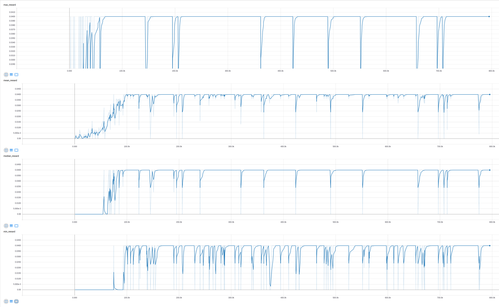

# Project 2: Continuous Control

## Environment: Reacher
**[Copied from the Udacity Environment description:](https://classroom.udacity.com/nanodegrees/nd893/parts/286e7d2c-e00c-4146-a5f2-a490e0f23eda/modules/089d6d51-cae8-4d4b-84c6-9bbe58b8b869/lessons/5b822b1d-5c89-4fd5-9b52-a02ddcfd3385/project)**

In this environment, a double-jointed arm can move to target locations. A reward of +0.1 is provided for each step that the agent's hand is in the goal location.

The observation space consists of 33 variables corresponding to position, rotation, velocity, and angular velocities of the arm. Each action is a vector with four numbers, corresponding to torque applicable to two joints. Every entry in the action vector should be a number between -1 and 1.

Note that Udacities math and documentation seems to be broken:
  * Udacity claims that the environment awards a reward of 0.1 each step the agent is at its goal. This is incorrect. 
  The agent gets a reward between 0.01 and 0.04 per step dependant on how close to the goal it is if it is reasonably close. 
  It gets 0.0 else.
  * Udacity convoluted the reward goal by combining disconnected metrics. Their goal is 30 rewards over 1000 steps (which
  is also not properly documented(!!!)). So running the algorithm for longer would invalidate all previous measurements.
  This approach is therefore very questionable. **The correct approach is to consider reward per agent per step.** 
  So basic math (30/1000 = 0.03) leads to the conclusion that the correct metric should be 0.03 reward per step per agent over 100 episodes,
  which is what is used in this report that strives for correctness.

We consider the environment as solved if it reaches 0.03 reward per step per agent over 100 episodes 

## Algorithm

PPO from this repository was used.

### Hyperparameters

**Learning Rate:** 2.5e-4

**Policy Clipping Rate:** 0.1

**Value Loss Coefficient:**: 1.0

**Episode Lenght:** 128

No minibatching is used, which is also not necessary as the 20 agents running in parallel provide uncorrelated
samples already.

All other hyperparameters are left as their default.

### Execution

Command line to run the experiment: `python main.py --env-name Reacher --unity-path "Reacher.x86_64" --algo ppo --use-gae --lr 2.5e-4 --clip-param 0.1 --value-loss-coef 1 --num-processes 1 --num-steps 128 --num-mini-batch 1 --vis-interval 1 --log-interval 1 --tensorboard-logdir trained_models/tboard --save-dir ""`

Note that the proper environment is already part of this repository.

### Neural network

Using ELU yielded significantly better performance than RELU. Batch normalization did not improve results.

```python
hidden_size=64

self.actor = nn.Sequential(
    init_(nn.Linear(num_inputs, hidden_size)),
    nn.ELU(),
    init_(nn.Linear(hidden_size, hidden_size)),
    nn.ELU(),
    init_(nn.Linear(hidden_size, hidden_size)),
    nn.ELU()
)

self.critic = nn.Sequential(
    init_(nn.Linear(num_inputs, hidden_size)),
    nn.ELU(),
    init_(nn.Linear(hidden_size, hidden_size)),
    nn.ELU(),
    init_(nn.Linear(hidden_size, hidden_size)),
    nn.ELU()
)
```

## Result

### Metrics over 100 episodes: 

**Median reward:** 0.0395294109
	
**% of maximum reward:** 98.8235271435

**Number of timesteps trained:** 800'000

### Graphs



## Stored weights

The model weights are stored in the `Reacher.pt` file in this repository.

## Improvements

The algorithm works already almost perfectly. The drops in reward come when the agent randomly resets which
resets the robot arms position and rotates the
target with a different speed. See this code:

```C++
public override void AgentReset()
    {
        pendulumA.transform.position = new Vector3(0f, -4f, 0f) + transform.position;
        pendulumA.transform.rotation = Quaternion.Euler(180f, 0f, 0f);
        rbA.velocity = Vector3.zero;
        rbA.angularVelocity = Vector3.zero;

        pendulumB.transform.position = new Vector3(0f, -10f, 0f) + transform.position;
        pendulumB.transform.rotation = Quaternion.Euler(180f, 0f, 0f);
        rbB.velocity = Vector3.zero;
        rbB.angularVelocity = Vector3.zero;

        goalDegree = Random.Range(0, 360);
        UpdateGoalPosition();

        goalSize = myAcademy.goalSize;
        goalSpeed = Random.Range(-1f, 1f) * myAcademy.goalSpeed;

        goal.transform.localScale = new Vector3(goalSize, goalSize, goalSize);
    }
```


